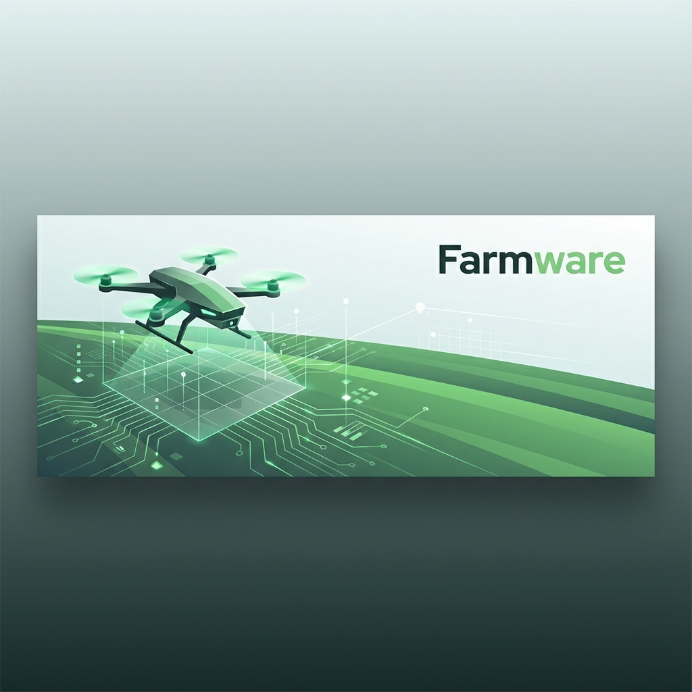

# Farmware



[](https://opensource.org/licenses/MIT)
[](https://www.python.org/downloads/)
[](https://github.com/psf/black)

**Farmware: Open source autonomous spraying software for precision farming, optimized for small-row and specialty crops.**

---

## Table of Contents
- [Overview](#overview)
- [Core Features](#core-features)
- [Equipment Required](#equipment-required)
- [Getting Started](#getting-started)
- [Roadmap](#roadmap)
- [Contributions](#contributions)
- [License](#license)

---

## Overview

Farmware is an open source solution designed to revolutionize small row and specialty farming. By automating the spraying process, Farmware helps reduce labor dependency, optimize crop management, and promote sustainability. With a modular architecture, it combines GPS, camera data, and advanced path planning algorithms to deliver precision farming capabilities.

---

## Core Features
... (rest of the content is similar, just added Getting Started and improved intro structure)

- **Field Mapping**:
  - Use GPS and camera data to create a digital map of the field.
  - Save and reuse mapped field layouts for future operations.

- **Autonomous Path Planning**:
  - Generate optimized routes based on the mapped field.
  - Avoid redundant coverage and minimize waste.

- **Precision Spraying**:
  - Synchronize spraying operations with tractor movement.
  - Monitor and manage spray rate and tank capacity in real time.

- **Open-Source Flexibility**:
  - Fully customizable and adaptable to various farming needs.
  - Community-driven development ensures iterative refinement and innovation.

---

## Equipment Required

To be able to deploy farmware, you'll need the following hardware:

### Sensors
- **GPS Module**:
  - E.g., [u-blox NEO-6M GPS Module](https://www.u-blox.com).
  - Provides real-time location data for field mapping and navigation.
- **Camera**:
  - Any USB or onboard camera compatible with OpenCV.
  - Used for detecting rows, boundaries, and obstacles.

### Actuators
- **Steering Controller**:
  - Motorized or hydraulic system for controlling tractor steering.
  - Options: Arduino, Raspberry Pi motor controller, or CAN bus interface.
- **Sprayer System**:
  - Electronic sprayer with flow sensors and pump control.

### Compute Unit
- **Raspberry Pi, Jetson Nano, or Laptop**:
  - Processes GPS, camera, and sensor data.
  - Runs the Farmware software.

### Power Supply
- **Battery or External Power Source**:
  - Ensures uninterrupted operation of sensors and compute units.

---

## Getting Started

### Installation

1. Clone the repository:
   ```bash
   git clone https://github.com/bahattinyunus/farmware.v1.git
   cd farmware.v1
   ```

2. Install dependencies:
   ```bash
   pip install -r requirements.txt
   ```

3. Run the application:
   ```bash
   python main.py
   ```

---

## Roadmap

### **Phase 1: Autonomous Spraying Prototype**
- [x] Develop and test field mapping using GPS and camera data.
- [ ] Implement path planning algorithms optimized for small row farming.
- [ ] Create a fully functional prototype capable of basic autonomous spraying.

### **Phase 2: Advanced Features**
- Showcase the prototype at the **World Ag Expo** (Feb 11–13, Tulare, California).
- Begin development of a universal, plug-and-play system.
- Enhance modularity for different field layouts.

### **Phase 3: Scalability and Community Collaboration**
- Expand mapping capabilities to support **3D field mapping**.
- Transition to drone-based mapping solutions.
- Build a strong open source community.

---

## Contributions

We welcome contributions! Please see our [CONTRIBUTING.md](CONTRIBUTING.md) for details on how to get started.

Please adhere to our [Code of Conduct](CODE_OF_CONDUCT.md) in all interactions.

---

## License

Farmware is licensed under the [MIT License](LICENSE).

---

### **Our Mission**

The goal of this project is to give small farmers a fighting chance to make their farms viable businesses without spending outrageous amounts on proprietary systems.
Farmware aims to provide a far superior solution for a fraction of the cost, democratizing access to precision agriculture technology.
